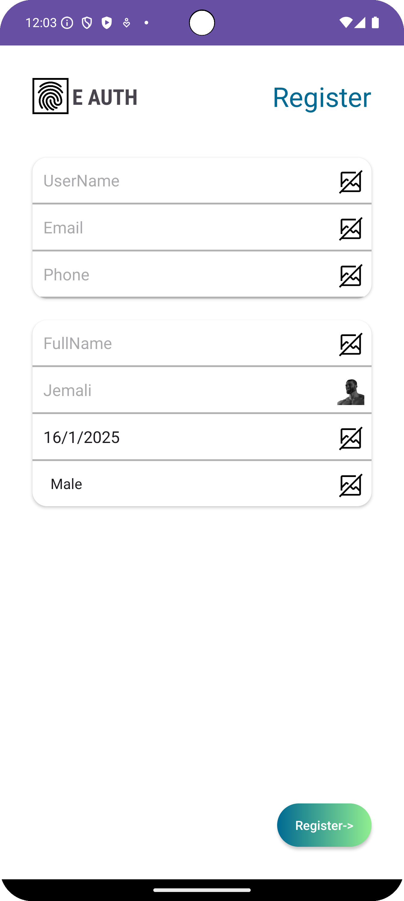
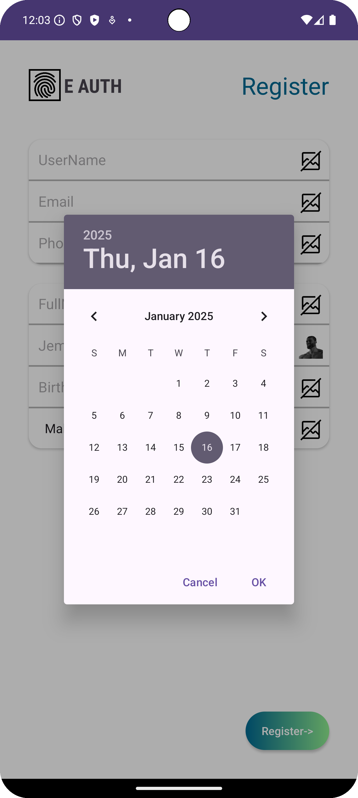

# E-Auth Registration Page (Assignment-16)

  

## Overview

This Android application, built with Kotlin, is designed to simulate an E-Authentication registration interface.
It parses hardcoded JSON data to dynamically create user input fields based on the provided field specifications.
The app provides a clean and responsive UI with various input types, ensuring a seamless registration experience.

The application uses **RecyclerView** to dynamically render form inputs and integrates features like date pickers and choosers for enhanced usability.

## Features

- **Dynamic Input Generation**: Parses hardcoded JSON to render input fields dynamically based on field type.
- **Various Input Types**: Supports text inputs, numeric inputs, dropdown choosers, and date pickers.
- **Validation Based on JSON**: Includes field-level validations such as required fields, input type checks, and format validation directly derived from the JSON data.
- **User-Friendly Design**: A responsive and clean UI adapts to various field types for a smooth registration process.

## JSON Parsing and Dynamic Rendering

The app processes a hardcoded JSON response, which includes field metadata such as `field_id`, `hint`, `field_type`, and other attributes. These metadata guide the rendering of inputs dynamically, ensuring flexibility and modularity.

## Screenshots

    
    

## How It Works

1. The app parses the hardcoded JSON to extract field details, including type, hint, validation rules, and other metadata.
2. A RecyclerView is used to dynamically generate input fields based on the parsed JSON.
3. Input types such as text, number, date, and dropdown are supported and rendered accordingly.
4. The app validates inputs using rules defined in the JSON, ensuring all required fields are taken care of.
5. Any validation errors are displayed as toasts
