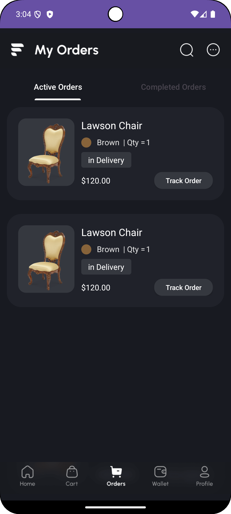
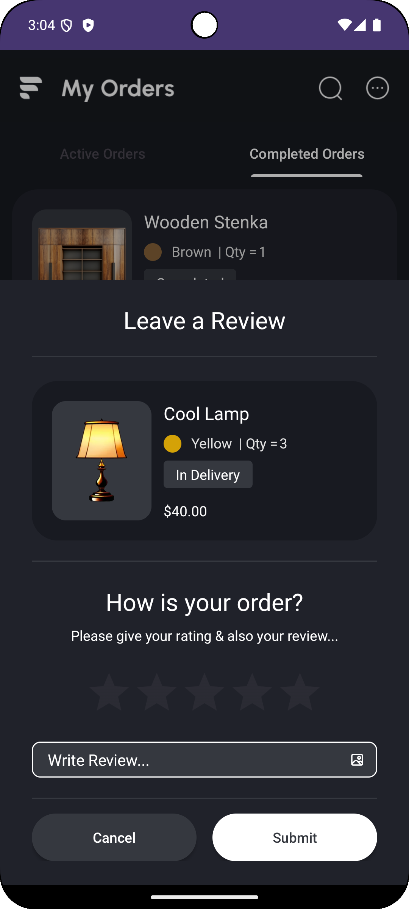

# Orders App (Assignment-14)

  
  

## Overview

This is a simple Android application built with Kotlin that features an orders page. 
The app utilizes `ViewPager2` to create a smooth swipeable interface with tabs for displaying 
different order statuses (e.g., Active, Completed). App also implements review functionality for completed orders

## Features

- **Swipeable Tabs**: Users can swipe between different tabs to view orders based on their status.
- **Dynamic Order Display**: The app dynamically displays order data using RecyclerView.
- **Swipeable Review Interface**: The app has implemented swipeable review functionality using BottomSheetDialogFragment.
- **User-Friendly Interface**: Intuitive design for easy navigation and interaction.

## Screenshots

    
    

