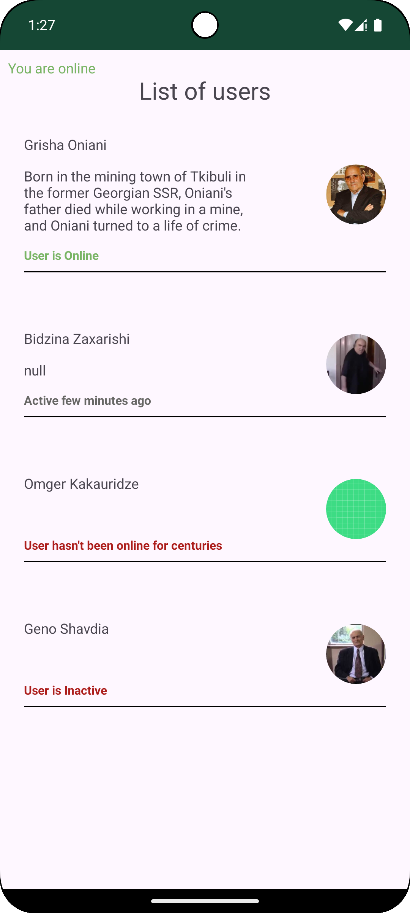

# Quiz Project 5 (Revisited) - Room User's List

  

## Overview

This Android project is a simple **user list application** that fetches data from an API using **Retrofit**, stores it in a local **Room database**, and displays it in the UI. The app also utilizes **Glide** for image loading and **Kotlin Serialization** for efficient JSON parsing.

## Features

- **Fetch users from API** using Retrofit and cache them in Room.
- **Offline support** – Data persists even when offline.
- **Image loading** using Glide.
- **Uses Flow for reactive data updates.**
- **Kotlin Serialization** for lightweight JSON parsing.

## How It Works

1. **Fetch users from API** and store them in Room.
2. **Display users** in a RecyclerView.
3. **Observe Room database changes** using Flow.
4. **Handle offline scenarios** gracefully.

## Screenshots

    

## Technologies Used

- **Kotlin**
- **Retrofit**
- **Room Database**
- **Glide**
- **StateFlow & Coroutines**
- **ViewModel & Repository Pattern**