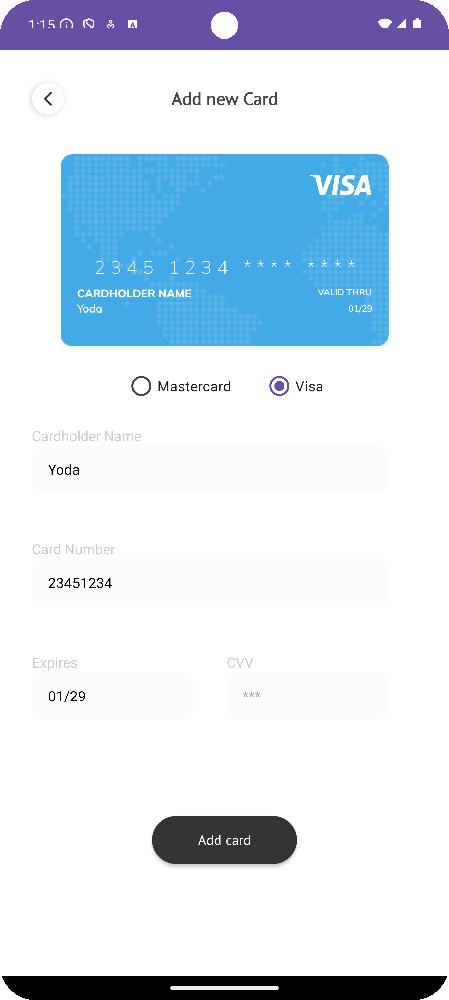
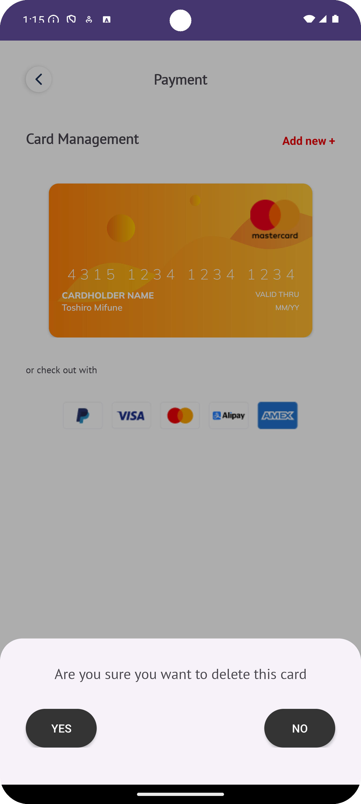

# Payment App (Assignment-15)

  
  

## Overview

This is a simple Android application built with Kotlin that features a payment cards management interface. 
The app utilizes `ViewPager2` to create a smooth swipeable experience for checking out payment cards, 
allowing users to easily add and delete cards with dynamic visuals. 

The App utilizes shared ViewModels to communicate between fragments

## Features

- **Swipeable Card Interface**: Users can swipe between different payment cards to view their details.
- **Dynamic Card Display**: The app dynamically displays payment card data using ViewPager2 and ListAdapter.
- **Add and Delete Functionality**: Users can easily add new cards or delete existing ones with an intuitive interface.
- **User-Friendly Design**: A clean and straightforward design enhances user navigation and interaction.

## Screenshots

    
    
    

