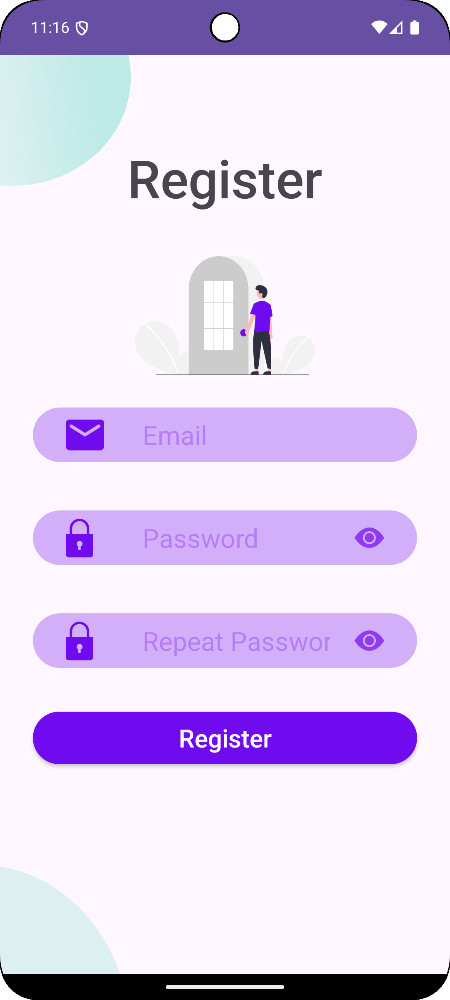

# E-Auth Login and Registration Page 2 (Assignment-19)

  

## Overview

Continuation of [Assignment-18](https://github.com/iraklyoda/tbc-it-academy-android/tree/assignment-18)

In the following tab new section on homepage was added, where you can check out list of users fetched from API

This Android application, built with Kotlin, provides a user authentication system where users can log in, register, and log out from the home page. The app integrates modern libraries and tools such as **DataStore**, **Kotlin Coroutines**, and **Retrofit** for efficient data management and seamless HTTP requests.

The backend services for this app use the [ReqRes API](https://reqres.in/api), which handles login and registration.

## Features

- **User Login**: Allows users to log in using a valid email and password combination.
- **User Registration**: Users can register using the supported email and password format.
- **Logout Functionality**: Users can log out from the home page, clearing the session token.
- **Token Management**: Uses DataStore for securely storing and managing the authentication token.
- **Validation**: Includes validations for email format and password fields to ensure data integrity.
- **Modern Architecture**: Implements Kotlin Coroutines for asynchronous tasks and Retrofit for network operations.

## API Details

The app interacts with the [ReqRes API](https://reqres.in/api) for authentication tasks and to get data regarding users:

- **Login Endpoint**: `POST /login`
- **Register Endpoint**: `POST /register`

- **Users Endpoint**: `GET /users?page=1`

### Authentication Details:
- Email: `eve.holt@reqres.in`
- Password: Any valid password (password validation is enforced on the client side).

**Note**: Only the above credentials work for this app due to the API's limitations.

## Libraries Used

- **Kotlin Coroutines**: For handling asynchronous tasks efficiently.
- **Retrofit**: For making API requests and managing responses.
- **DataStore**: For persistent and secure storage of the authentication token.
- **Glide**: For fetching, decoding, and displaying images

## How It Works

1. **Login Process**:
    - User enters the required email and password.
    - Credentials are validated, and a login request is sent to the API.
    - On success, the received token is saved securely using DataStore.
    - The app navigates to the home page with the session active.

2. **Registration Process**:
    - User provides email and password to register.
    - On success, a token is received and stored, and the user is navigated to the home page.

3. **Logout Process**:
    - User goes to separate profile page
    - User clicks the logout button on the home page.
    - The authentication token is cleared from DataStore, and the user is navigated back to the login page.

## Screenshots

    
    
    

## Notes

- The app supports only the email `eve.holt@reqres.in` for login and registration due to the limitations of the ReqRes API.
- Password validation is enforced in the app, but any properly formatted password is accepted by the API.