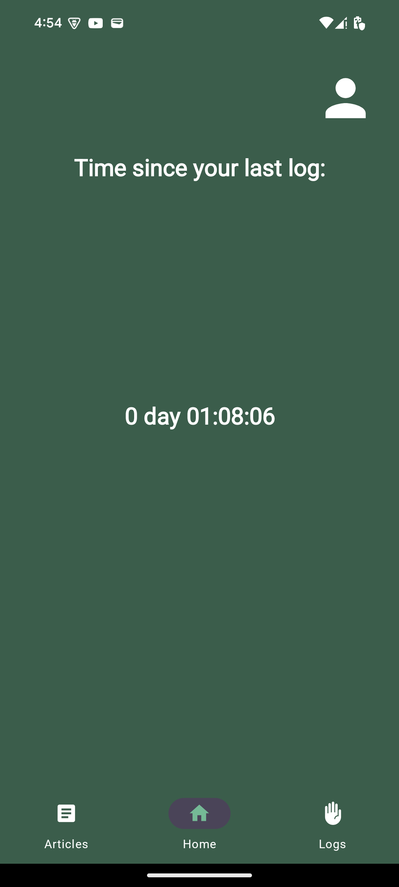

# Tricholog: Trichotillomania Support App

  

## Overview

Tricholog is an Android application designed to help individuals struggling with trichotillomania and raise awareness about this condition. The app provides a platform where users can log in or register, navigate to articles about trichotillomania, add logs when they experience hair-pulling moments, and check a timer to see the elapsed time since their last log.

This application is built using modern libraries and tools, including **Firebase Authentication**, **View Binding**, **Navigation Graph**, **ViewModels**, **Clean Architecture**, **Hilt** for dependency injection, and **Retrofit** for networking.

## Features

- **User Authentication**: Users can log in and register to access the app's features.
- **Article Navigation**: Users can explore articles related to trichotillomania to gain insights and support.
- **Log Management**: Users can add logs to record their hair-pulling episodes, fostering self-awareness.
- **Timer Functionality**: Displays the elapsed time since the last log entry, helping users track their progress.
- **Modern Architecture**: Implements Clean Architecture principles for maintainable and testable code.

## Libraries Used

- **Firebase Authentication**: For managing user authentication securely.
- **View Binding**: For easier and safer view access within the app.
- **Navigation Component**: For seamless navigation between fragments and activities.
- **ViewModels**: To handle UI-related data in a lifecycle-conscious way.
- **Hilt**: For dependency injection, simplifying the management of app components.
- **Retrofit**: For making API requests and managing responses.

## How It Works

1. **Login/Registration Process**:
    - Users can either log in with their existing credentials or register a new account.
    - Upon successful login or registration, users are directed to the main features of the app.

2. **Navigating Articles**:
    - Users can navigate to a dedicated section to read articles related to trichotillomania, offering education and support.

3. **Logging Episodes**:
    - Users can add logs whenever they experience hair-pulling moments, helping to build self-awareness.

4. **Timer Functionality**:
    - A timer displays the elapsed time since the last log entry, encouraging users to track their progress.

## Screenshots

    
    
    

## Notes

- This app aims to provide support and raise awareness about trichotillomania.
- User authentication is managed through Firebase for enhanced security.